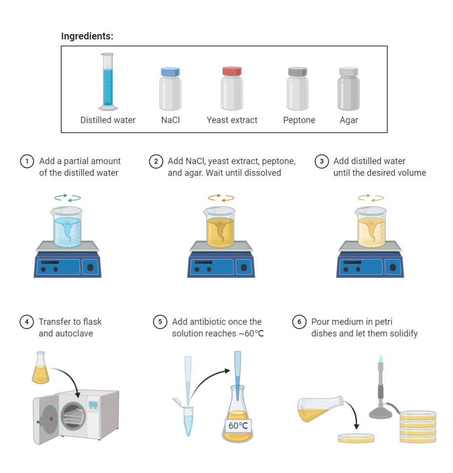
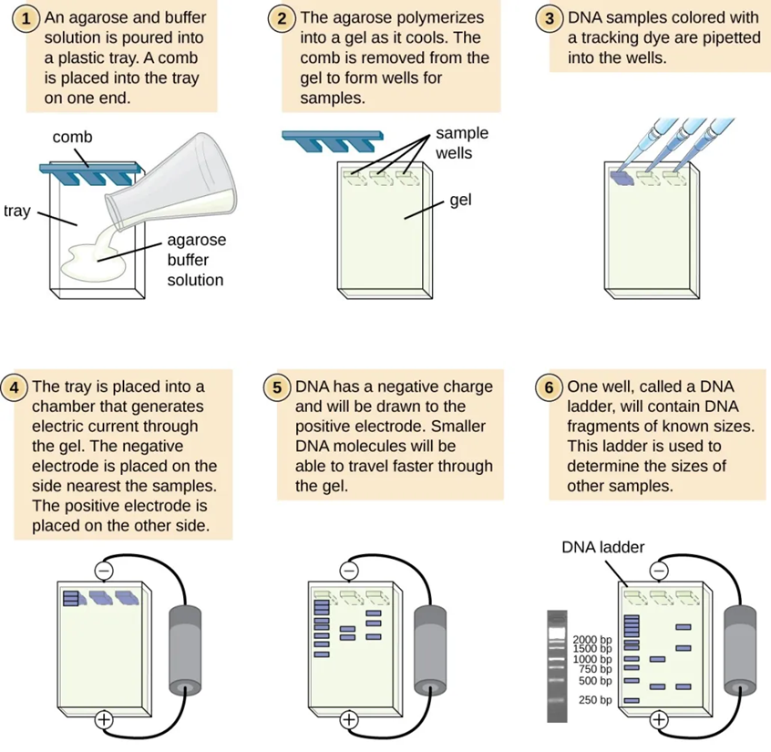

# Gene Cloning and qPCR Standard Preparation

Bench-ready workflow for cloning a gene-of-interest PCR product into a
plasmid, confirming the insert, preparing plasmid stocks, and aliquoting
qPCR standards.

**Workflow**Cloning to standards

**Calendar time**~4-7 d

**Active time**~12-17 h

**Critical QC**Colony PCR + Sanger

------------------------------------------------------------------------

## Before Starting

**Source status**

This page is the web-ready conversion of
`Experiments Protocol-Gene cloning & qPCR Standards2025.docx`, with
quick-reference notes from `gene cloning protocol.pdf`. When the DOCX
and PDF differ, treat the DOCX workflow as the main source and treat the
PDF values as lab-notebook variants to confirm before use.

**Contamination control**

Keep pre-PCR setup, post-PCR products, competent cells, and plasmid
stocks physically separated when possible. Use sterile tips and fresh
gloves when switching between PCR, cloning, transformation, and colony
handling.

**Stop before changing selective conditions**

Confirm the vector, antibiotic, competent-cell type, primer pair, and
expected insert size before beginning. Antibiotic concentration, vector
choice, and colony selection criteria are not interchangeable.

------------------------------------------------------------------------

## Workflow Plan

| Day | Work |
|----|----|
| Day 1 | Prepare LB plates and broth; amplify gene-of-interest; clean PCR product; quantify PCR product; set up ligation; incubate ligation overnight if needed. |
| Day 2 | Transform ligation into competent *E. coli*; plate on selective LB plates with X-Gal when blue-white screening is used; incubate overnight. |
| Day 3 | Screen 8-10 white colonies by colony PCR; run gel; start overnight colony culture or restreak selected colonies. |
| Day 4 | Make glycerol stocks; purify positive colony PCR products for Sanger sequencing or extract plasmid from positive cultures. |
| Day 5+ | Confirm sequence, quantify plasmid, dilute plasmid standards, aliquot qPCR standards, and store at -80 deg C. |

**Target qPCR standard stocks**

| Standard targets | Stock type | Typical amount |
|----|----|----|
| 16S, ITS, nifH, AOA/AOB/comx amoA, nirK/S, nosZI | *E. coli* stock | 4-5 tubes |
|  | Plasmid stock | 10 tubes, 50 uL each, 20-100 ng/uL |
|  | qPCR standard stock | 40-50 tubes, 20 uL each, 2-4 ng/uL |

------------------------------------------------------------------------

## Materials

**LB Medium and Plates**

| Component                                      | Amount for 500 mL |
|------------------------------------------------|------------------:|
| Tryptone                                       |               5 g |
| Yeast extract                                  |             2.5 g |
| NaCl                                           |               5 g |
| Agar, plates only                              |               6 g |
| Kanamycin, electrocompetent-cell workflow      |  25 mg per 500 mL |
| Ampicillin, chemically competent-cell workflow |  25 mg per 500 mL |

**PCR and Cleanup**

| Material                               | Catalog \# | Company   |
|----------------------------------------|------------|-----------|
| GoTaq Green Master Mix                 | M7122      | Promega   |
| Primers, forward and reverse           |            | IDT       |
| T100 Thermal Cycler                    | 1861096    | Bio-Rad   |
| QIAquick PCR Purification Kit          | 28104      | Qiagen    |
| Agarose, 1X TAE, DNA ladder, gel stain |            | Lab stock |

**Cloning and Transformation**

| Material | Catalog \# | Company |
|----|----|----|
| TA Cloning Kit with pCR 2.1 Vector | K204001 | ThermoFisher Scientific |
| Promega pGEM T-Easy Vector | Use for bacterial 16S primers if pCR 2.1 performs poorly | Promega |
| One Shot TOP10 Chemically Competent *E. coli* | K204001 | ThermoFisher Scientific |
| X-Gal | V3941 | Promega |

**Quantification and Plasmid Preparation**

| Material                  | Catalog \# | Company                 |
|---------------------------|------------|-------------------------|
| Qubit dsDNA HS Assay      | Q32851     | ThermoFisher Scientific |
| Qubit Assay Tubes         | Q32856     | ThermoFisher Scientific |
| QIAprep Spin Miniprep Kit | 27104      | Qiagen                  |

------------------------------------------------------------------------

## PCR Setup Calculator

Number of PCR reactions

Include samples, controls, and extra reactions. Totals include 10%
overage.

PCR reaction volume (uL)

Template DNA per reaction (uL)

| Component              | Per reaction |     Total | Total + 10% |
|------------------------|-------------:|----------:|------------:|
| GoTaq Green Master Mix |        10 uL |     10 uL |       11 uL |
| Forward primer, 10 uM  |         1 uL |      1 uL |      1.1 uL |
| Reverse primer, 10 uM  |         1 uL |      1 uL |      1.1 uL |
| Template DNA           |         2 uL |      2 uL |      2.2 uL |
| Water                  |         6 uL |      6 uL |      6.6 uL |
| **Final reaction**     |    **20 uL** | **20 uL** |   **22 uL** |

**Check water volume**

If water becomes negative, reduce template or primer volume, or increase
final reaction volume before preparing reactions.

------------------------------------------------------------------------

## Ligation Insert Calculator

Insert size (bp)

Vector size (bp)

Vector mass (ng)

Purified PCR product concentration (ng/uL)

| Ratio target      | Insert mass | Insert volume at current concentration |
|-------------------|------------:|---------------------------------------:|
| 1:1 insert:vector |      7.7 ng |                                 0.4 uL |
| 3:1 insert:vector |     23.1 ng |                                 1.2 uL |

**Formula**

Insert mass for a 1:1 molar ratio is
`(insert size bp x vector mass ng) / vector size bp`. The original notes
recommend keeping insert:vector molar ratio between 1:3 and 3:1, with
1:1 often giving good results.

------------------------------------------------------------------------

## Qubit Working Solution Calculator

Number of DNA samples

Calculator includes 2 standards and 2 extra tubes.

| Qubit item       | Per tube | Total tubes |   Total |
|------------------|---------:|------------:|--------:|
| Qubit buffer     |   199 uL |          12 | 2388 uL |
| Qubit reagent    |     1 uL |          12 |   12 uL |
| Working solution |   200 uL |          12 | 2400 uL |

------------------------------------------------------------------------

## Standard Dilution Calculator

Plasmid stock concentration (ng/uL)

Target qPCR standard concentration (ng/uL)

Final standard volume (uL)

| Dilution item |  Volume |
|---------------|--------:|
| Plasmid stock |   30 uL |
| Diluent       |  970 uL |
| Final volume  | 1000 uL |

**Concentration check**

If the target concentration is higher than the stock concentration, do
not dilute. Re-quantify, concentrate the plasmid, or choose a lower
target.

------------------------------------------------------------------------

## Part A: Prepare LB Plates and Broth

*~3-4 h elapsed; ~1-1.5 h active*

Add tryptone, yeast extract, NaCl, and agar to less than 500 mL Milli-Q
water in a 1 L bottle. For broth, omit agar.

Adjust to pH 7.0.

Autoclave at 121 deg C and 20 psi for at least 30 min.

Cool medium before adding antibiotic.

Prepare kanamycin or ampicillin stock in the hood. For kanamycin,
dissolve 50 mg in 1 mL water, mix well, and filter through a 0.22 um
filter.

Add antibiotic to cooled medium according to the vector and
competent-cell workflow.

Pour about 25 plates from 500 mL medium in the hood.

Prepare LB broth the same way, without agar.



LB medium preparation

------------------------------------------------------------------------

## Part B: Extract Template DNA

*~1.5-2 h*

Use this section when template DNA must be extracted before PCR.

| Material                        | Catalog \# | Company |
|---------------------------------|------------|---------|
| DNeasy PowerLyzer PowerSoil Kit | 12855-100  | Qiagen  |

**Before starting**

Perform centrifugation at room temperature. If Solution C1 has
precipitated, heat at 60 deg C until dissolved. Shake Solution C4 before
use.

Add up to 0.25 g soil sample to the PowerBead tube.

Add 750 uL PowerBead Solution.

Add 60 uL Solution C1 and invert several times or vortex briefly.

Balance tubes in the Fisherbrand Bead Mill 24 Homogenizer. Run PROG 01
(s=2.75, c=01, T=0.50, D=0.15) or PROG 02 (s=2.75, c=02, T=0.30,
D=0.15).

Centrifuge at 10,000 x g for 30 s. Do not exceed 10,000 x g. For clay
soils or incomplete pellets, centrifuge for 3 min.

Transfer supernatant to a clean 2 mL collection tube. Expect about
400-500 uL.

Add 250 uL Solution C2, vortex 5 s, and incubate at 2-8 deg C for 5 min.

Centrifuge 1 min at 10,000 x g. Avoid the pellet and transfer up to 600
uL supernatant to a clean 2 mL tube.

Add 200 uL Solution C3, vortex briefly, and incubate at 2-8 deg C for 5
min.

Centrifuge 1 min at 10,000 x g. Avoid the pellet and transfer up to 750
uL supernatant to a clean 2 mL tube.

Add 1200 uL Solution C4 and vortex 5 s.

Load 675 uL supernatant onto an MB Spin Column and centrifuge 1 min at
10,000 x g. Discard flow-through and repeat until all supernatant has
passed through the column.

Add 500 uL Solution C5 and centrifuge 30 s at 10,000 x g.

Discard flow-through and centrifuge again for 1 min at 10,000 x g.

Place the spin filter in a clean 2 mL collection tube.

Add 100 uL Solution C6 to the center of the membrane and incubate 2 min.
Sterile DNA-free PCR-grade water or TE buffer may be used instead.

Centrifuge 30 s at 10,000 x g and discard the spin column.

------------------------------------------------------------------------

## Part C: Amplify the Gene of Interest

*~3-4 h elapsed; ~1-1.5 h active*

Select primers for the gene of interest.

Dilute forward and reverse primers to 10 uM before use.

Set up PCR reactions using the calculator above or the source table
below.

| Component              | 50 uL reaction | 20 uL reaction |
|------------------------|---------------:|---------------:|
| GoTaq Green Master Mix |          25 uL |          10 uL |
| Forward primer         |           1 uL |           1 uL |
| Reverse primer         |           1 uL |           1 uL |
| DNA                    |           2 uL |           2 uL |
| Water                  |       To 50 uL |       To 20 uL |

**Default PCR program from the DOCX source**

| Step | Temperature | Time | Cycles |
|----|---:|---:|---:|
| Initial denaturation | 94 deg C | 3 min | 1 |
| Denaturation | 94 deg C | 1 min | 30 |
| Annealing | 50-60 deg C, usually 5 deg C below primer Tm | 1 min | 30 |
| Extension | 72 deg C | 1 min | 30 |
| Final extension | 72 deg C | 7 min | 1 |
| Hold | 4 deg C | Hold |  |

**Lab-notebook variant from PDF**

| Step                 | Temperature |  Time | Cycles |
|----------------------|------------:|------:|-------:|
| Initial denaturation |    95 deg C | 5 min |      1 |
| Denaturation         |    95 deg C |  30 s |     30 |
| Annealing            |  59.2 deg C |  30 s |     30 |
| Extension            |    72 deg C | 1 min |     30 |
| Final extension      |    72 deg C | 5 min |      1 |
| Hold                 |    12 deg C |  Hold |        |

Run 5 uL PCR product on an agarose gel to confirm amplification.

For a quick gel check, prepare 1.5-2% agarose for 500 bp to 10 kb
fragments. A PDF note uses 2 g agarose per 100 mL buffer.

Add gel stain according to the lab stock. The DOCX note uses 2.5 uL SYBR
Safe in 50 mL gel; the PDF note uses 10 uL stain per 100 mL gel.

Run gel at 50-100 V for 20-30 min, or until the dye front reaches about
two-thirds of the tray.

Image the gel on the Bio-Rad GelDoc Go using the appropriate stain
setting.



PCR gel check example

------------------------------------------------------------------------

## Part D: Purify PCR Product

*~30-45 min*

| Material                      | Catalog \# | Company |
|-------------------------------|------------|---------|
| QIAquick PCR Purification Kit | 28104      | Qiagen  |

**Before starting**

Add ethanol to Buffer PE before use and mark the bottle. Carry out
centrifugation at room temperature. The source DOCX lists 13,000 rpm for
tabletop microcentrifuge steps.

Add 5 volumes Buffer PB to 1 volume PCR reaction and mix.

Place a QIAquick column in the provided 2 mL collection tube.

Apply sample to the column and centrifuge 30-60 s until the sample has
passed through.

Discard flow-through and place the column back into the same collection
tube.

Add 750 uL Buffer PE and centrifuge 30-60 s.

Discard flow-through and centrifuge 1 min to remove residual wash
buffer.

Place the column in a clean 1.5 mL microcentrifuge tube.

Elute DNA with 50 uL Buffer EB or water. For increased concentration,
use 30 uL, let stand 1 min, then centrifuge.

If running purified DNA on a gel, add 1 volume loading dye to 5 volumes
purified DNA.

**Gel purification option**

If non-target bands are present, cut the correct band from the gel and
use a gel purification kit such as QIAquick Gel Extraction Kit, catalog
28704.

------------------------------------------------------------------------

## Part E: Ligate PCR Product into Vector

*~30-60 min active; overnight optional*

| Material | Catalog \# | Company |
|----|----|----|
| TA Cloning Kit with pCR 2.1 Vector | K204001 | ThermoFisher Scientific |
| Promega pGEM T-Easy Vector | Use for bacterial 16S primers if needed | Promega |

**Fresh PCR product**

Use fresh PCR product when possible. The DOCX notes that single 3 prime
A-overhangs degrade over time, reducing ligation efficiency.

Centrifuge one vial of vector briefly to collect liquid at the bottom.

Use the calculator above to estimate insert mass and insert volume.

Do not use more than 2-3 uL PCR sample in the ligation reaction unless
confirmed, because salts in PCR sample may inhibit T4 DNA ligase.

Target insert:vector molar ratio between 1:3 and 3:1. A 1:1 ratio often
gives good results.

| Ligation component | Standard reaction |
|----|---:|
| Fresh purified PCR product | x uL, often 4-5 uL if concentration allows |
| 5X T4 DNA Ligase Reaction Buffer | 2 uL |
| pCR 2.1 vector, 25 ng/uL | 2 uL |
| T-Easy vector, 50 ng/uL | 1 uL if using pGEM T-Easy workflow |
| Water | To 9 uL before ligase |
| ExpressLink T4 DNA Ligase, 5 units | 1 uL |
| **Final volume** | **10 uL** |

Assemble ligation reaction on ice or according to kit guidance.

Incubate at room temperature for at least 15 min.

For higher efficiency, incubate up to 1 h or overnight when appropriate.

Store ligation at -20 deg C if transformation will not be done
immediately.

**PDF lab-notebook ligation variant**

| Component        |    Volume |
|------------------|----------:|
| PCR product      |    2.5 uL |
| T4 DNA Ligase    |      1 uL |
| T-Easy Vector    |      1 uL |
| Ligation buffer  |      5 uL |
| DI water         |    0.5 uL |
| **Final volume** | **10 uL** |

**16S note**

The DOCX notes: use GoTaq Green PCR Master Mix, pGEM T-Easy Vector, and
JMP competent cells for cloning bacterial 16S amplicons. Other amplicons
may use either ligation and cloning product set. Confirm vector and cell
choice before starting.

------------------------------------------------------------------------

## Part F: Transform into Competent E. coli

*~18-24 h elapsed; ~1-1.5 h active*

| Material | Catalog \# | Company |
|----|----|----|
| One Shot TOP10 Chemically Competent *E. coli* | K204001 | ThermoFisher Scientific |

**Before starting**

Equilibrate a water bath to 42 deg C. Bring S.O.C. medium to room
temperature. Equilibrate selective LB plates at 37 deg C for 30 min.
Spread each plate with 40 uL of 40 mg/mL X-Gal and let it soak in when
blue-white screening is used.

Centrifuge ligation vials briefly and place on ice.

Thaw one 50 uL vial of frozen competent cells on ice for each
transformation.

Pipette 2 uL ligation reaction directly into competent cells and mix
gently with the pipette tip.

Incubate on ice for 30 min.

Heat-shock at 42 deg C without shaking. DOCX uses 30 s; PDF note uses 45
s. Confirm before running.

Immediately transfer cells to ice.

Add recovery medium. DOCX uses 250 uL S.O.C.; PDF note uses 950 uL LB
medium. Confirm the chosen competent-cell protocol.

Shake horizontally at 37 deg C and 225 rpm. DOCX uses 1 h; PDF note uses
90 min.

Spread 10-200 uL from each transformation on selective LB agar with
X-Gal and either 50 ug/mL kanamycin or 100 ug/mL ampicillin.

Plate at least two volumes so one plate has well-spaced colonies. For
small volumes, add 20 uL S.O.C. to spread evenly.

Incubate plates overnight at 37 deg C.

Transfer plates to 4 deg C for 2-3 h to allow proper color development.

Pick at least 10 white colonies and grow each on a new plate and/or 2-5
mL selective LB broth overnight.

------------------------------------------------------------------------

## Part G: Screen Colonies by Colony PCR

*~3-4 h elapsed; ~1-1.5 h active*

| Material                            | Catalog \# | Company   |
|-------------------------------------|------------|-----------|
| LB plates with antibiotic and X-Gal |            | Lab-made  |
| Sterile toothpicks or sterile tips  |            | Lab stock |

**M13 colony PCR reaction**

| Component | Volume |
|----|---:|
| Taq polymerase or master mix | 15 uL |
| Forward primer | 0.6 uL |
| Reverse primer | 0.6 uL |
| Water | 13.8 uL |
| Colony DNA | Touch a colony with sterile toothpick or tip and transfer to PCR tube |
| **Final volume** | **30 uL** |

Pick 8-10 white colonies for screening.

Touch each colony with a sterile toothpick or pipette tip and transfer
to the assigned PCR tube.

Run M13 PCR: 94 deg C for 1 min; then 30 cycles of 98 deg C for 5 s, 55
deg C for 5 s, and 72 deg C for 40 s.

Run 5 uL of each reaction on a 1% agarose gel.

Select colonies with the expected insert band for Sanger sequencing and
plasmid stock preparation.

------------------------------------------------------------------------

## Part H: Sanger Sequencing

*~15-30 min active; ~1-3 business days turnaround*

Purify positive colony PCR products using the PCR purification section
above.

Prepare each sample according to the sequencing provider requirements.
The source notes refer to Azenta Life Sciences / Genewiz.

For pCR 2.1 insert sequencing, prepare a premix of purified PCR product
and M13R primer, or the provider-requested single primer.

Record sample name, primer, expected insert size, concentration, and
submission ID.

**PDF note**

The PDF note says Sanger samples should be about 1 ng/uL, 10 uL sample,
with 5 uL of 5 nM forward primer. Confirm current provider requirements
before submission.

------------------------------------------------------------------------

## Part I: Quantify DNA by Qubit

*~30-45 min*

Set up the required number of Qubit tubes for samples and the 2
standards.

Use thin-wall, clear 0.5 mL Qubit assay tubes for the Qubit 4
Fluorometer.

Label tube lids, not tube sides.

Prepare Qubit working solution with 199 uL buffer and 1 uL reagent per
tube, or use the calculator above.

Add 190 uL working solution plus 10 uL standard to each standard tube.

Add 198 uL working solution plus 2 uL sample to each user sample tube.

Vortex 3-5 s without making bubbles.

Incubate at room temperature for 2 min.

On the Qubit home screen, select dsDNA, then dsDNA High Sensitivity.

Read Standard 1 and Standard 2 when prompted.

Select sample volume and units, then read each sample tube.


Qubit working solution reference

------------------------------------------------------------------------

## Part J: Prepare Plasmid Stock and qPCR Standards

*~1-2 d elapsed; ~3-5 h active*

Spread each prepared LB plate with 40 uL of 40 mg/mL X-Gal and let
liquid soak in.

Streak *E. coli* with confirmed correct inserts onto selective LB agar
with X-Gal and the correct antibiotic.

Incubate at 37 deg C for 24 h.

Scrape and collect biomass into microcentrifuge tubes.

Extract plasmid using QIAprep Spin Miniprep Kit.

### QIAprep Plasmid Purification

Resuspend pelleted bacterial cells in 250 uL Buffer P1 and transfer to a
microcentrifuge tube.

Add 250 uL Buffer P2 and mix by inverting 4-6 times until clear. Do not
let lysis proceed for more than 5 min.

Add 350 uL Buffer N3 and immediately invert 4-6 times.

Centrifuge for 10 min at 13,000 rpm.

Apply 800 uL supernatant to the QIAprep 2.0 spin column and centrifuge
30-60 s. Discard flow-through.

Wash with 0.5 mL Buffer PB, centrifuge 30-60 s, and discard
flow-through.

Wash with 0.75 mL Buffer PE, centrifuge 30-60 s, and discard
flow-through.

Centrifuge 1 min to remove residual wash buffer.

Place column in a clean 1.5 mL microcentrifuge tube.

Elute with 50 uL Buffer EB or water. Let stand 1 min and centrifuge 1
min.

### Plasmid Copy Number

Use this formula:

``` text
copy number per uL =
(plasmid concentration ng/uL x 6.022e23) /
(plasmid size bp x 650 g/mol x 1e9)
```

Where:

- Plasmid concentration is in ng/uL.
- Plasmid size is in bp.
- 650 g/mol is the average molecular weight of a double-stranded DNA
  base pair.
- 1e9 converts ng to g.

### Aliquot qPCR Standards

Gather the required *E. coli* stock, plasmid stock, and standard stock
tubes before dilution.

Dilute plasmid stock to a final concentration of 2-4 ng/uL, using the
calculator above when helpful.

Aliquot 20 uL plasmid standard into 0.5 mL microcentrifuge tubes.

Prepare 40-50 qPCR standard tubes when making the routine standard stock
set.

Store qPCR standards at -80 deg C.

------------------------------------------------------------------------

## Part K: Optional Restriction Digest of Plasmid DNA

*~2-3 h elapsed; ~1-1.5 h active*

Reference: [Addgene restriction digest
protocol](https://www.addgene.org/protocols/restriction-digest/)

Select restriction enzyme or enzymes for the plasmid.

Check the plasmid vector map or analyze the sequence with Addgene
Sequence Analyzer.

Determine the correct reaction buffer. For double digests, use an enzyme
compatibility chart such as NEB Double Digest Finder.

Prepare a 50 uL reaction with 1 ug DNA, 1 uL of each restriction enzyme,
5 uL 10X buffer, and water to 50 uL.

Mix gently by pipetting.

Incubate at the enzyme-appropriate temperature, usually 37 deg C, for 1
h or overnight.

Purify the digest with a DNA cleanup kit if needed.

Visualize digest by 1% agarose gel electrophoresis for about 40 min.


Restriction enzyme planning screenshot


Sequence analyzer screenshot 1


Sequence analyzer screenshot 2


Restriction digest gel example

------------------------------------------------------------------------

## Lab Notebook Quick Reference

These notes came from `gene cloning protocol.pdf`. Use them as a quick
reference, not as a replacement for the main workflow.

| Stage | Notebook note |
|----|----|
| PCR | 20 uL reaction: 10 uL master mix, 7 uL DI water, 1 uL primer mix, 2 uL DNA. Program: 95 deg C 5 min; 30 cycles of 95 deg C 30 s, 59.2 deg C 30 s, 72 deg C 1 min; 72 deg C 5 min; hold 12 deg C. |
| Gel | 2% gel: 2 g agarose per 100 mL buffer; 10 uL gel dye per 100 mL gel. Load 1 uL dye, 1 uL ladder or 5 uL sample, and 3 uL DI water as noted. |
| PCR purification | Use all PCR sample when needed; Buffer PB = 5 x sample volume; wash with 750 uL PE; elute with 30 uL EB. |
| Ligation | Notebook example: 2.5 uL PCR product, 1 uL T4 DNA Ligase, 1 uL T-Easy Vector, 5 uL ligation buffer, 0.5 uL DI water. |
| Transformation | Notebook variant: 50 uL competent cells, 2 uL ligation, ice 30 min, 42 deg C for 45 s, 950 uL LB, shake at 225 rpm for 90 min, plate and incubate overnight at 37 deg C. |
| Colony PCR | Same as regular PCR but notebook note says 19 cycles. Confirm before use. |
| Plasmid stock | Collect colony biomass from plates, extract plasmid, quantify by NanoDrop, dilute to 2-4 ng/uL, prepare 40 tubes of 20 uL standards. |
| Glycerol stock | Mix 500 uL 50% glycerol solution with 500 uL colony culture in screw-cap tube and store at -80 deg C. |

------------------------------------------------------------------------

## Bench Record

|                              |                                |
|------------------------------|--------------------------------|
| Date                         |                                |
| Operator                     |                                |
| Project / gene target        |                                |
| Primer pair                  |                                |
| Expected insert size         |                                |
| Vector                       | pCR 2.1 / pGEM T-Easy / Other  |
| Competent cells              |                                |
| Antibiotic                   | Ampicillin / Kanamycin / Other |
| PCR program                  |                                |
| PCR gel image file           |                                |
| PCR product concentration    |                                |
| Ligation insert:vector ratio |                                |
| Transformation plate IDs     |                                |
| White colonies screened      |                                |
| Colony PCR gel image file    |                                |
| Sanger submission ID         |                                |
| Confirmed colony ID          |                                |
| Plasmid concentration        |                                |
| qPCR standard concentration  |                                |
| Standard tube count          |                                |
| Storage location             | -80 deg C                      |
| Notes                        |                                |

Export as PNG

------------------------------------------------------------------------

## Bench Notes

Clear notes

Notes are saved locally in this browser.

------------------------------------------------------------------------

## Stop Points

**Stop and ask before**

- Using a different vector, competent-cell strain, antibiotic, or
  blue-white screening setup than planned.
- Proceeding when PCR gives non-specific bands or no expected band.
- Ligating an old PCR product without confirming that the vector
  workflow tolerates it.
- Transforming before confirming the recovery medium, heat-shock time,
  antibiotic, and X-Gal setup.
- Picking blue colonies when blue-white screening is being used for
  insert selection.
- Sending Sanger samples without recording primer, expected insert size,
  sample concentration, and submission ID.
- Diluting qPCR standards when plasmid concentration, plasmid size, or
  target standard concentration is uncertain.
- Treating the PDF quick-reference parameters as the active protocol
  when they conflict with the DOCX workflow.
